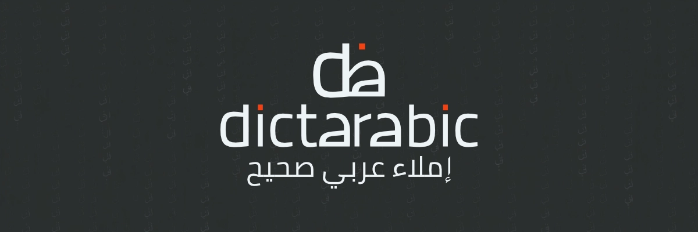
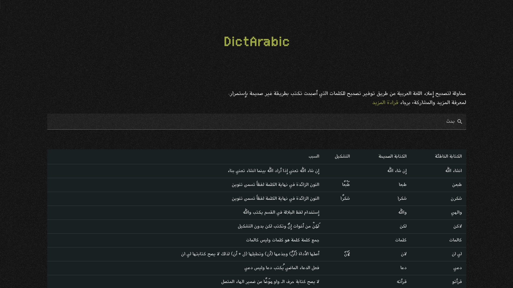

# DictArabic by [mohamedation](https://mohamedation.com)

**:book: إملاء عربي صحيح**

**تقدر تشوفه من هنا :link: [DictArabic](https://mohamedation.com/projects/dict-arabic/try)**
**تقدر تقرأ اكتر من هنا :link: [DictArabic](https://mohamedation.com/projects/dict-arabic)**
**إضافة المتصفح من هنا :link: [DictArabic Extension](https://mohamedation.com/projects/dict-arabic-extension)**

محاولة لتصحيح إملاء اللغة العربية عن طريق توفير تصحيح للكلمات التي أصبحت تكتب بطريقة غير صحيحة بإستمرار.
انا شخصيا لا ادعي معرفتي الكاملة بقواعد الإملاء الصحيحة وإتعلمت حاجات كتير من أول ما بدأت اركز في محاولتي الأولى مع [بوت تويتر](https://twitter.com/DictArabic).
القاموس نفسه بقى يغذي [إضافة المتصفح](https://mohamedation.com/projects/dict-arabic-extension) اللي بتصحح الأخطاء أثناء الكتابة. الإضافة متوفرة لـ [كروم](https://chromewebstore.google.com/detail/dictarabic/limhlhbidnajbkfkpmljnnldngokdlnb) و [فايرفوكس](https://addons.mozilla.org/addon/dictarabic/).

## المشكلة
انتشار طريقة كتابة مليئة بالاخطاء الاملائية سواء عن غير قصد او عن عدم معرفة..كما اصبح توضيح تلك الاخطاء يقابل في الأغلب بصد وهجوم. حاولت بطريقة بسيطة عن طريق بوت تويتر اني انشر ولو حاجة بسطية من الأخطاء اللي بتقابلني وبعدها قررت ان يكون في طريقة يقدر اي حد يشارك بالكلمات اللي بيشوفها ويكون في مرجع نقدر نحاول نصلح ما يمكن اصلاحه علي الأقل عن طريق توفير مرجع او قاعدة بيانات يمكن إستخدامها في دراسة المشكلة او الحاقها في مشاريع اخرى مثل [بوت تويتر](https://twitter.com/DictArabic).

## توضيح
- اللغة العربية لغة تستحق كل الإحترام لذلك وجب المحافظة عليها.
- لكل بلد، بل ولكل منطقة لهجة مختلفة وليس الهدف التقليل من أي لهجة.
- التحدث والنطق لا علاقة لهم بطريقة الكتابة والإملاء الصحيح.
- المشكلة الإملائية بالنسبة لي ليس لها علاقة باللغة العامية او الفصحي...بل طريقة الكتابة الخاطئة حتى للكلمات العامية.

## إضافة المتصفح
إضافة متصفح لتصحيح أخطاء الإملاء العربية الشائعة **أثناء الكتابة** في أي حقل نصي. ليست مدقق إملائي شامل لكل الكلمات العربية لكن يتم التركيز على الأخطاء اليومية اللي الناس بتكتبها فعلاً زي (انشاء الله، لاكن، طبعن، وغيرها).

قاعدة البيانات من مشروع DictArabic المجتمعي المفتوح المصدر. أي إضافة أو تصحيح بتساعد بشكل كبير في تصحيح أكبر عدد ممكن من الأخطاء الشائعة في الكتابة.

- [متجر Chrome](https://chromewebstore.google.com/detail/dictarabic/limhlhbidnajbkfkpmljnnldngokdlnb)
- [إضافات Firefox](https://addons.mozilla.org/addon/dictarabic/)
- تفاصيل أكتر: [DictArabic Extension](https://mohamedation.com/projects/dict-arabic-extension)

### كيفية التشغيل؟
- قم بتثبيت الإضافة وتفعيلها
- عند كتابة اي كلمة خاطئة موجودة بالقاموس تظهر لوحة علي اسفل اليسار بالكلمة او العبارة الخاطئة و الصحيحة
- اختار التصحيح، أو استبدال الكل، أو قم بتفعيل الاستبدال التلقائي من الإعدادات
- خيار **التشكيل** يستبدل الكلمة بالكلمة الصحيحة بالتشكيل ان وجدت في القاموس
- يتم تجاهل حقول كلمات المرور

### الخصوصية
لا يتم تجميع اي بيانات عن طريق الإضافة او التواصل مع اي خوادم خارجية.

## ازاي تساعد؟
- لو عارف كلمة بتتكتب بطريقة غير صحيحة وتعرف تستخدم Github تقدر تعمل pull request بكل بساطة.
- لو معندكش خبرة في Github تقدر تقول الكلمة و الصح بتاعها عن طريق الـissues.
- كل مساهمة في القاموس بتساعد المرجع وإضافة المتصفح مع بعض.