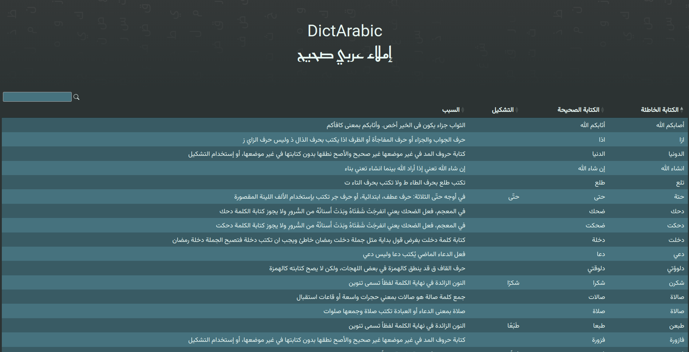

# DictArabic by [mohamedation](https://mohamedation.com)

**:book: إملاء عربي صحيح**

**تقدر تشوفه من هنا :link: [DictArabic](https://mohamedation.com/DictArabic)**

محاولة لتصحيح إملاء اللغة العربية عن طريق توفير تصحيح للكلمات التي أصبحت تكتب بطريقة غير صحيحة بإستمرار.
انا شخصيا لا ادعي معرفتي الكاملة بقواعد الإملاء الصحيحة وإتعلمت حاجات كتير من أول ما بدأت اركز في محاولتي الأولي مع [بوت تويتر](https://twitter.com/DictArabic).

## المشكلة
انتشار طريقة كتابة مليئة بالاخطاء الاملائية سواء عن غير قصد او عن عدم معرفة..كما اصبح توضيح تلك الاخطاء يقابل في الأغلب بصد وهجوم. حاولت بطريقة بسيطة عن طريق بوت تويتر اني انشر ولو حاجة بسطية من الأخطاء اللي بتقابلني وبعدها قررت ان يكون في طريقة يقدر اي حد يشارك بالكلمات اللي بيشوفها ويكون في مرجع نقدر نحاول نصلح ما يمكن اصلاحه علي الأقل عن طريق توفير مرجع او قاعدة بيانات يمكن إستخدامها في دراسة المشكلة او الحاقها في مشاريع اخرى مثل [بوت تويتر](https://twitter.com/DictArabic).

## توضيح
- اللغة العربية لغة تستحق كل الإحترام لذلك وجب المحافظة عليها.
- لكل بلد، بل ولكل منطقة لهجة مختلفة وليس الهدف التقليل من أي لهجة.
- التحدث والنطق لا علاقة لهم بطريقة الكتابة والإملاء الصحيح.
- المشكلة الإملائية بالنسبة لي ليس لها علاقة باللغة العامية او الفصحي...بل طريقة الكتابة الخاطئة حتي للكلمات العامية.

## ازاي تساعد؟
- لو عارف كلمة بتتكتب بطريقة غير صحيحة وتعرف تستخدم Github تقدر تعمل pull request بكل بساطة.
- لو معندكش خبرة في Github تقدر تقول الكلمة و الصح بتاعها عن طريق الـissues.
- ملف CSV موجود في فولدر data :scroll: [DictArabic.csv](./data/DictArabic.csv)

## CSV to HTML Table
Thanks for @derekeder for the original code for CSV to HTML Table. for more information and original code, please visit [CSV to HTML Table](https://github.com/derekeder/csv-to-html-table).
